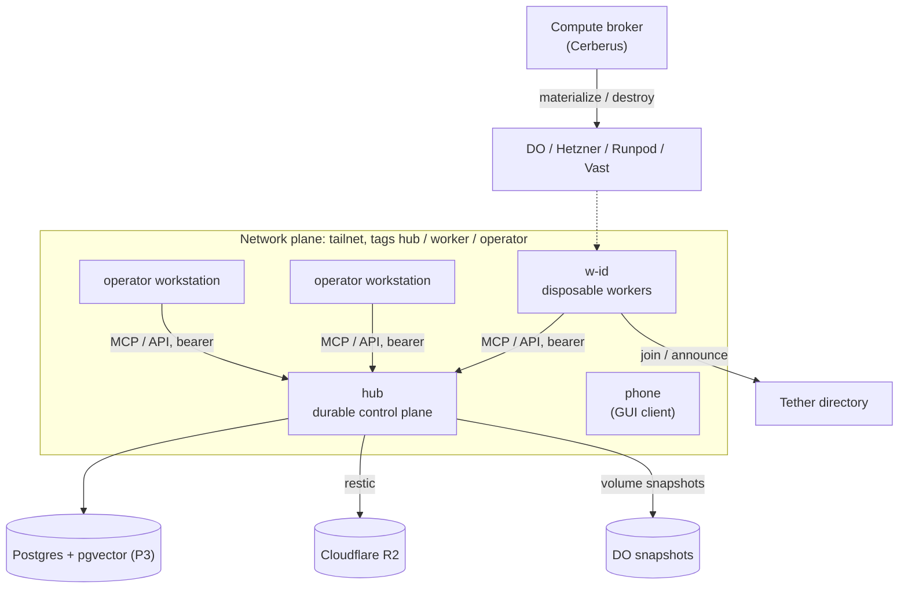

# Compute & Hosting: Target State

Where Cerberus's compute and hosting work is heading. It starts with an always-on hub
that every machine coordinates through and ends with a compute broker that creates,
registers, runs and destroys disposable workers across providers.

Status: agreed direction, 2026-10-04. Nothing is executed yet.
Workstream: Tether `compute-hosting`. Torque project: **Compute & Hosting**.
Companion plan: `docs/plans/cerberus-plugins-roadmap.md` (Tether `cerberus-plugins`).

**This document describes the end state and the phase boundaries, not task-level
detail.** The work breakdown lives in Torque. Where this document and a task
disagree, fix both.

Read first: `docs/plans/infra-admin-control-plane.md` (the admin lane),
`docs/adr/0002-resource-only-local-workload-model.md` (the supervision lane), and
`docs/plans/live-systems-security-target.md` (which every gate added here must
converge on).

## The one-paragraph version

One small, durable, always-on **hub** runs the portfolio's
coordination services: Tether, Torque, Tesseract, Tangent, Nanite, Hadron, Station,
Flux and its own Cerberus. Every machine (the operator's workstations, and later disposable
workers) reaches the hub over a **Tailscale tailnet** and nothing else. Each machine
runs its **own Cerberus** to supervise its own services. The hub's state is backed up
off-provider from day one through a **core backup contract**, and the hub can be
**rebuilt from a descriptor plus a restore** on any supported provider. Disposable
compute is requested from the hub, never run on it. A **compute broker** resolves a
workload's *requirements* to a provider, materializes a worker, registers it with
Tether, and destroys it when the work is checkpointed.

## Invariants

A task that breaks one of these is wrong even if its tests pass.

| # | Invariant | Why |
|---|---|---|
| H1 | **The hub is control plane only.** It never runs agents, builds or inference, and it never scales itself. | A durable core must stay boring. Capacity is requested elsewhere. |
| H2 | **No public inbound to anything, until the auth/security track lands.** Tailnet only; the provider firewall denies all inbound. | Most services are loopback-trust by design. The tailnet is the boundary until real auth exists. |
| H3 | **Every network client authenticates.** A service reached from another machine requires a bearer token, even on the tailnet. | A tailnet admits devices, not callers. Tokens are what make per-machine revocation and audit possible. |
| H4 | **Every machine runs its own Cerberus.** It supervises only that machine's services. Remote hosts are administered through the admin lane, never supervised. | Keeps the supervision lane local (AGENTS.md "Two lanes"). |
| H5 | **State is backed up off-provider and the restore is tested.** A backup that has never been restored doesn't count. | The DR plan is "rebuild", and rebuilding is only as good as the restore. |
| H6 | **The hub can be rebuilt from its descriptor plus a restore**, on DO or Hetzner, with no hand edits. | We invest in rebuilding fast instead of in redundancy. |
| H7 | **Workers are disposable.** The durable thing is the *workload definition*, not the machine. Workers are never hibernated. | Provider portability, and stopped machines still bill. |
| H8 | **Artifacts are built off the hub.** CI or a builder produces them, and the hub installs them. | H1, and changed source is not deployed source (AGENTS.md). |
| H9 | **Canonical names are stable.** Clients use `<app>.<domain>`. Moving a service between hosts is a DNS change, not a client reconfiguration. | Cutover and rollback become a DNS flip. |
| H10 | **Every provider write goes through the admin lane**: `Destructive`/`SupportsDry`/`--ack`, audited, DTOs (ADR 0003). The broker gets no side door. | `live-systems-security-target.md` I1. |

## Layers and ownership



| Plane | Owns | Lives in |
|---|---|---|
| Network | Tailnet, ACL tags, DNS, TLS | Tailscale + Cloudflare plugins; Caddy on each host |
| Provider | Machines, volumes, firewalls, buckets, snapshots | Provider plugins (`cerberus-plugins`), admin lane |
| Host | A named target with a role and a descriptor; bootstrap | Cerberus registry + host descriptor → cloud-init |
| Service | Supervised services on a host | Each host's Cerberus, supervision lane, `run_from: artifact` |
| Data | Databases, backups, restore verification | Service-owned DBs; core backup contract |
| Fleet / broker | Workload definitions, provider resolution, lifecycle, cost history | Cerberus broker + Tether directory |

The layer boundary between apps, which the broker must not blur:

- **Cerberus:** what resources should exist.
- **Hadron:** what execution should occur.
- **Nanite:** what intelligent work should occur.
- **Tether:** who or what exists, and how to reach it.

Swarm scaling crosses the layers by request, never by reaching into each other: Nanite
needs capability X → Hadron/policy asks for two workers of profile Y → Cerberus resolves
the provider and provisions → Tether reports that the workers joined → Hadron/Nanite
assign work.

## Hosts and names

Hosts are named after the machine; the role comes from the registry. Roles:

| Role | Example | Notes |
|---|---|---|
| hub | `hub.<domain>` | A small VM (2 vCPU / 4 GB is plenty) with a block volume for service data, Ubuntu LTS. One per operator. |
| operator | a workstation or laptop | Runs its own Cerberus, coordinates through the hub, may also take work. |
| worker | `w-<id>.<domain>` | Broker-created (P5+), never hand-named, destroyed after use. |

GUI-only devices (a phone, for example) are tailnet clients, not Cerberus hosts. The
operator's actual hosts, domain, region and addresses belong in the operator's own
deployment notes, never in this repo (AGENTS.md).

### DNS and TLS

The pattern is proven on an existing operator host, so the hub copies it rather than
inventing a new one:

- The domain's DNS is on Cloudflare. Each record is a **DNS-only A record pointing at a
  tailnet IP**, so a name resolves publicly but only connects from the tailnet.
- Caddy binds **only the host's tailnet IP** (`default_bind`) and gets wildcard certs
  through Cloudflare DNS-01, using a token scoped to DNS edit on that zone.
- Each service is `<app>.<host>.<domain>` → `127.0.0.1:<port>` on that host. The
  canonical `<app>.<domain>` points at whichever host currently serves the app (H9).
- Staging: while the hub is being built it serves `*.hub.<domain>`. At cutover the
  canonical names flip to the hub, and the previous host keeps
  `*.<old-host>.<domain>` for rollback.

## Service placement on the hub

| Service | Port (loopback) | State today | Remote clients | Notes |
|---|---|---|---|---|
| Tether (tetherd + sysop) | tetherd TCP, sysop 8947 | SQLite `~/.tether/state/tether.db` | Streamable HTTP `/mcp`, bearer; `tether mcp --daemon-only` | `identity.mode: enforce` on the hub, one token per machine. Clients go **straight to the hub**, with no federation for now. |
| Torque | 8990 | SQLite; Postgres partial | `torque mcp --remote=<url>` / `TORQUE_MCP_REMOTE`, `TORQUE_API_TOKEN` | Replace the Caddy loopback-Host trick with real token mode. Set `TORQUE_CORS_ORIGINS` for the GUI. |
| Tesseract | 8089 | SQLite; pgvector index unwired | **none: `tesseract mcp` opens local SQLite** | P0 blocker: remote MCP mode or Streamable HTTP MCP. `--managed-auth` for REST. |
| Tangent | 7842 | SQLite `~/.tangent/` | MCP `/mcp` (loopback Host) | Runs exactly as on its current host, behind the Caddy same-origin adapter. Long-term shape TBD. |
| Nanite | 8090 | SQLite | HTTP API | Basic auth env exists; behind Caddy. |
| Hadron | 8095 | SQLite `~/.hadron/state/` | MCP/HTTP, bearer on all paths | Behind the Caddy same-origin adapter, as on its current host. |
| Station | e.g. 8080 | stateless | HTTP MCP, optional bearer | Needs a `*.cerberus.yaml` descriptor. |
| Flux | static | none | browser | **A production static build served by Caddy**, never the vite dev server; `/api` proxies to Nanite. |
| Cerberus | socket; console 4783 | `~/.cerberus/` | console (passkey), CLI/MCP over tailnet (later) | Supervises everything above as systemd user units. Its own daemon is not a resource (AGENTS.md). |

Each service keeps its own database (no shared DB) until P3. With that rule, SQLite on
the hub is correct for P0–P2, and the write queues the apps already have carry the load.

## Data plane

### Databases

- **P0–P2: SQLite, one database per service**, on the block volume. Backups use online
  `sqlite3 .backup` (or the app's own snapshot), never a file copy of a live database.
- **P3: Postgres + pgvector is the default for the hub.** SQLite remains the default for
  local and single-node use. The reason is architectural, not traffic: Tesseract
  already needs pgvector, and the write volume is pushing SQLite hard. Torque has
  partial Postgres support (`TORQUE_POSTGRES_DSN`, an incomplete migration set).
  Tesseract has an unwired `PgVectorIndex`. Tether is SQLite-only. Each service moves on
  its own schedule, and each gets SQLite → Postgres migration tooling.
- One Postgres instance, a database per service, and no cross-service schema.

### Core backup contract (Cerberus)

Today Cerberus core only restores config `.bak` files. The `restic` and `rsync`
plugins exist but share no contract. Backup becomes a core concept with the same
adapter / provider / capability / policy shape as connectors and secret backends.

```yaml
# on a resource
backup:
  paths: [/var/lib/fabric/torque]
  consistency: sqlite_online      # sqlite_online | pg_dump | command | none
  databases: [/var/lib/fabric/torque/main.db]

# operator-owned, ~/.cerberus/backup.yaml (shape illustrative)
targets:
  r2-offsite:  { provider: restic, repo: "s3:https://<acct>.r2.cloudflarestorage.com/fabric-hub", secrets: [restic_password, r2_access_key, r2_secret_key] }
  do-snapshot: { provider: digitalocean, kind: volume_snapshot }
policies:
  hub-nightly:
    sources: [tether, torque, tesseract, tangent, nanite, hadron]
    targets: [r2-offsite]
    schedule: "0 3 * * *"
    retention: { daily: 7, weekly: 4, monthly: 6 }
    verify: { restore_test: weekly }
```

- **`BackupSource`:** a resource, its paths and a consistency hook, declared next to the
  resource.
- **`BackupTarget`:** a provider plus a repo reference. Credentials are secret refs
  (`docs/secrets.md`) and never literals.
- **`BackupPolicy`:** binds sources to targets with a schedule, retention, encryption
  and **verification**: a periodic restore into a scratch directory with checksum and
  integrity checks (H5).
- **Provider interface:** plugins implement `cerberus.backup/{plan,run,list,restore,verify,prune}`
  through the same internal-command pattern as `cerberus.secret/resolve`. `restore` and
  `prune` are `Destructive` + `SupportsDry`. `run` is a lifecycle write.
- **Observability:** last-success age per source, a stale-backup warning in `resource
  status` and the console, and audit entries for every run, restore and prune.
- First adapters: restic (R2, DO Spaces, local). Then volume snapshots from provider
  plugins, then rsync for plain mirrors.

P0 runs restic by hand from a systemd timer (`Phase 0` below). P2 replaces that with
the contract, and the P0 timer is the acceptance test the contract has to reproduce.

## Secrets on a headless hub

The OS keyring needs a desktop session and D-Bus, so the hub resolves secrets from the
**1Password service-account backend** (the `onepassword` plugin, `op://` refs). The one
bootstrap credential (the service-account token) is placed at provisioning and never
lives in the descriptor. Per-machine service tokens (Tether, Torque, Tesseract) are
minted per host, stored as refs, and revocable one at a time.

## Artifacts and deploys

- Services ship as release artifacts built by CI (GitHub Releases), or by a builder
  machine in P0/P1. Never on the hub (H8).
- The hub's Cerberus installs them as `run_from: artifact` resources:
  `cerberus resource deploy <id>` fetches and installs, and `artifact_stale` reports drift.
- Getting the artifact onto the hub in P0/P1 is `cerberus ssh put` or a release
  download. Fetching release assets through the GitHub plugin follows in P2.
- **Never deploy the hub's Cerberus daemon through its own socket** (AGENTS.md). The
  same build-to-temp, `mv`, `systemctl --user restart` procedure applies on the hub.

## Observability, cost, hardening

- **Health:** a health probe per service and a hub summary (`cerberus resource list` on
  the hub, plus the console). Disk, memory and backup age come from the `sysmon` and
  `journalctl` plugins. OTel comes later and must not block any phase.
- **Cost:** droplet, volume, snapshot, R2 and egress tracked per resource. The broker
  (P6) enforces budgets.
- **Hardening:** unattended-upgrades, `ufw` default-deny (allow `tailscale0` only), the
  provider firewall denying all inbound, SSH only over the tailnet (Tailscale SSH or
  sshd bound to the tailnet IP), the operator user in the `docker` group at provisioning
  (`infra-admin-control-plane.md`), and no secrets in cloud-init user-data beyond a
  short-lived, single-use, tagged Tailscale auth key.

## Disposable workers and the broker (end state)

**Workload definition.** This is the durable object. A machine is just one
materialization of it:

```yaml
worker: coding-agent
image: agent-base@<digest>     # Claude/Codex/Gemini CLIs, Tether, git, tooling
resources: { cpu: 8, memory: 16GB, gpu: null, storage: 40GB }
environment: { secrets: [op://fabric/worker/github_token] }
bootstrap: [tailscale_join, tether_announce, project_checkout]
network: { tailnet_tag: worker, egress: default }
timeout: 2h
budget: 0.50
persistence: { checkpoint: git_push+artifacts, destroy_on: done|timeout|idle }
```

**Lifecycle:** materialize → bootstrap (authenticate, join the tailnet, announce
identity and capabilities to Tether, pull config) → execute → checkpoint (push,
artifacts, state to the hub) → **destroy**. Never stop and keep: a stopped DO droplet
still bills.

**Broker resolution.** A request states requirements, never a provider:

```yaml
workload: coding-agent
cpu: 8
memory: 16GB
expected_duration: 45m
interruptible: true
region: us
budget: 0.20
```

The broker scores local idle capacity, DO, Hetzner, and later Runpod and Vast, picks
one, and records cost, duration and outcome as broker history for later decisions.
Resource classes are kept distinct: **machine** (DO, Hetzner, later Vultr), **GPU
machine** (Runpod, Vast), **serverless** (Modal, Runpod Serverless), and **inference**
(the existing AI gateway). Rollout order: DO + Hetzner CPU first, then Runpod + Vast GPU.

Every provisioning call is an ordinary admin-lane operation (H10), so the
broker inherits ack, dry-run, audit, and eventually policy and approval from
`live-systems-security-target.md`. An agent that asks for a worker passes through the
same gate as an operator who asks for one.

## Infrastructure as code (end state)

Cerberus does not become an IaC engine. It **projects** its resource definitions into
established ones:

| Use | Execution strategy |
|---|---|
| Development | direct Cerberus API |
| Persistent core (the hub) | OpenTofu projection |
| Larger deployment | Kubernetes projection (k8s plugin exists) |
| Temporary agent environment | direct provider API through the broker |
| Local | Docker/Compose projection |

The imperative lane (`create_server`, `snapshot`, `destroy`) and the declarative lane
(a desired stack, then a projection, then a plan) coexist. A disposable worker never
needs a Terraform plan. The hub eventually should have one.

## Phases

| Phase | Goal | Exit criteria |
|---|---|---|
| **P0: Temporary core hub** | Tether, Torque and Tesseract central on a hub built by hand from a written runbook, with Cerberus installed on the hub to supervise them. | Every operator machine reads and writes the hub through its Tether MCP proxy using its own token; nightly restic → R2 plus one tested restore; the coordinated cutover is done and the previous host's copies are kept read-only for rollback. |
| **P1: Full hub** | Tangent, Nanite, Hadron, Station and Flux join, all supervised by the hub's Cerberus. | All 9 services healthy on the hub; GUIs reachable over the tailnet from every operator device, phone included; Flux served as a static build; canonical names flipped. |
| **P2: Reproducible hub** | Host descriptor + cloud-init, CI artifacts, the core backup contract, provider ops via plugins. | The hub rebuilt from scratch by Cerberus plus a restore, with no hand edits (DR drill 1, on DO). The P0 runbook is retired. |
| **P3: Durable data** | Postgres + pgvector on the hub; per-service migration. | Torque and Tesseract on Postgres (Tether's path decided); backups cover PG; restore tested. |
| **P4: Second provider** | Hetzner plugin dogfooded. | DR drill 2: the hub rebuilt on Hetzner from backups and a DNS flip. |
| **P5: Disposable workers** | Workload definition and the materialize/destroy lifecycle on DO and Hetzner; Tether join. | An agent task runs on a broker-created worker that is destroyed afterwards, with its result checkpointed to the hub. |
| **P6: Broker and fleet** | Requirement-based resolution, cost and outcome history, GPU providers, OpenTofu projection. | The broker picks a provider from requirements within budget; fleet view in Tether. |

### Phase 0 in detail

**App readiness comes first and blocks everything else.** P0 is mostly an
application-readiness problem, not an infrastructure one:

1. **Tesseract:** add a remote MCP mode (`tesseract mcp --remote=<url>` proxying over
   REST with a bearer, or Streamable HTTP `/mcp` on `tesseract serve`). Today it always
   opens local SQLite.
2. **Tether:** remote daemon addressing from env or a flag (today it comes only from the
   catalog file); hub configuration in `identity.mode: enforce`; per-machine token
   minting; each machine's `tether mcp --proxy` pointed at the hub's tetherd and the
   hub's Torque and Tesseract.
3. **Torque:** run with `TORQUE_API_TOKEN` and drop the loopback-Host trick; check the
   GUI's behavior in token mode; set CORS origins.

**Hub build, done by hand from a written runbook.** The runbook is the specification P2
automates, so write down every command:

1. DO droplet + volume in the region nearest the operator; DO firewall denying all inbound; operator user,
   `docker` group, unattended-upgrades, ufw.
2. Tailscale join with a single-use auth key tagged `tag:hub`; tailnet SSH.
3. Caddy bound to the tailnet IP; wildcard `*.hub.<domain>` via DNS-01 with a
   DNS-scoped Cloudflare token; Cloudflare A records `hub.<domain>` and
   `*.hub.<domain>` pointing at the tailnet IP.
4. 1Password service account for secrets; Cerberus installed as a systemd user unit;
   descriptors registered for Tether, Torque and Tesseract with data on the volume;
   artifacts delivered from a builder.
5. Backups: R2 bucket plus a scoped R2 token; restic repo; a systemd timer running
   online SQLite backups → restic nightly; **one restore test** into scratch with
   checksums.

**Cutover (Tether, Torque and Tesseract only), coordinated once:**

1. Announce a freeze; stop dispatch (Torque scheduler off) and stop agent sessions.
2. Stop writers on the current host; take an online backup of each DB and record checksums.
3. Transfer and restore on the hub; verify checksums and row counts; start the services.
4. Flip the canonical `torque.`, `tesseract.` and `tether.<domain>` names to the hub;
   keep the previous host's names serving its copies **read-only** for rollback.
5. Repoint each machine's Tether proxy at the hub using its own token; verify reads and
   writes from every operator machine.
6. Resume dispatch. Rollback = flip DNS back and restore the proxy configs, valid until
   the first new write on the hub is accepted as authoritative.

## Dependencies on the plugins workstream

`docs/plans/cerberus-plugins-roadmap.md` holds the detail. What each phase needs:

| Phase | Needs |
|---|---|
| P0 | Nothing blocking. Provider work is done by hand (DO console, Cloudflare dashboard, Tailscale admin). Cloudflare token scopes (DNS edit, R2) are recorded so the plugin work can reproduce them. |
| P2 | DO: firewalls, volumes, snapshots, SSH keys, tags. Cloudflare: R2 buckets + scoped tokens, DNS for the host records. Tailscale: auth-key mint, device list/remove. GitHub: release asset download. restic adapter on the backup contract. |
| P4 | The Hetzner plugin. |
| P5–P6 | Runpod, Vast; an OpenTofu projection (later). |

## Open questions

- **Tether at scale.** Hub-only is decided for now. When workers multiply, should a
  per-host tetherd federate to the hub (`docs/messaging-federation.md`)? Revisit in P5.
- **Tangent's long-term shape.** It runs on the hub as on its current host until its own plan
  says otherwise.
- **Remote Cerberus targeting.** Do workers' CLI and MCP reach the *hub's* Cerberus over
  the tailnet, and with what auth? Today the socket is local only. Needed by P5; design
  against `live-systems-security-target.md` (principal, surface).
- **Public exposure.** Which GUIs or APIs, if any, go public, and behind what? This
  belongs to the auth/security track, and H2 holds until then.

## References

- Research inputs (2026-10): `fabric-service-hosting.md`, `compute-broker-control-pane.md`,
  `idea-git-opps-app.md` (kept with the operator's notes).
- The operator's deployment plan (hosts, domain, region, cutover names) lives in the
  operator's own notes, not here.
- Remote-client readiness: `torque/cmd/torque/mcp.go` (`--remote`),
  `tether/cmd/tether/mcp.go` (`--daemon-only`), `tether/internal/identity/middleware.go`
  (`ValidateBind`), `tesseract/cmd/tesseract/main.go` (`validateExposure`, `mcp`).
