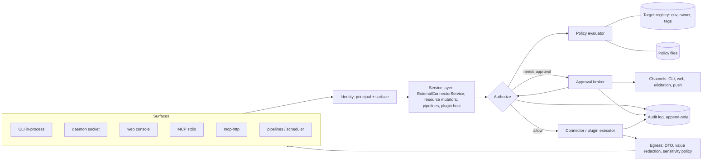
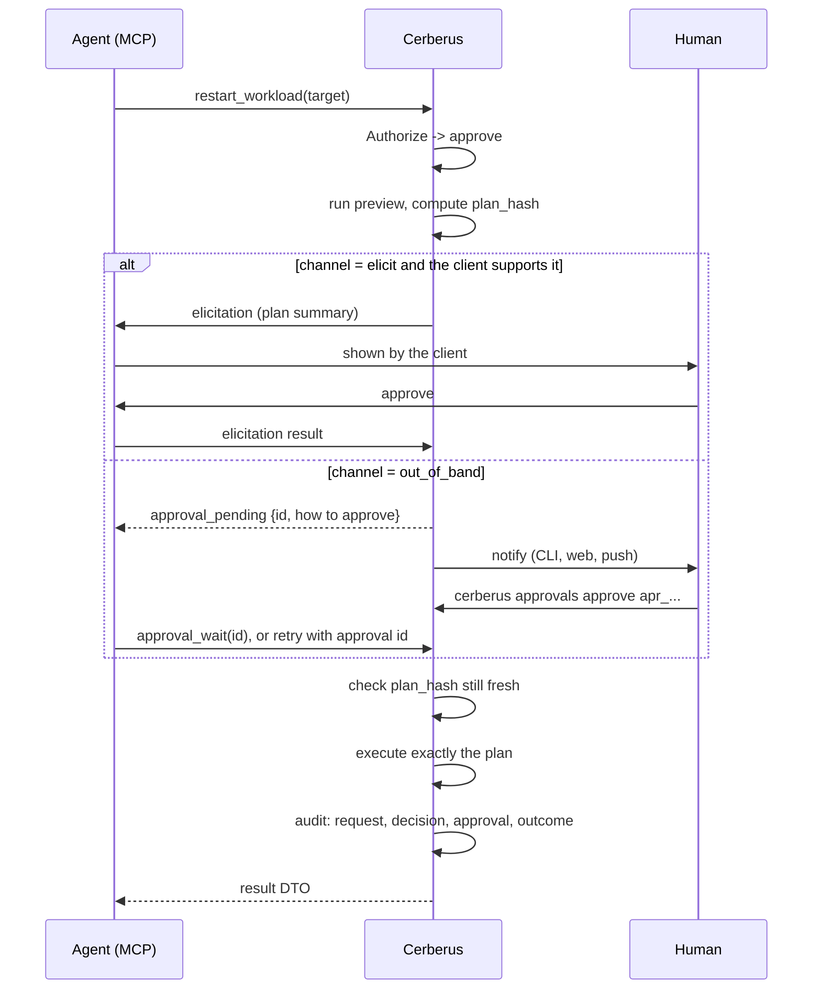

# Live Systems Security: Target State

Where Cerberus's safety model should end up so it can be pointed at live
systems: per-provider and per-target policy, human approval for writes,
deletes and restarts, DTOs on everything that comes back, and a record of all
of it.

Written 2026-09-25. Decisions taken the same day are recorded under
"Decisions" near the end. **This is a sketch of the end state, not a work
breakdown.** A later session works backwards from it into concrete tasks.
`docs/plans/agent-authority-and-secrets.md` stays the near-term plan (WP-S1 to
WP-S9). This document is what those work packages converge on, plus the pieces
they do not cover yet. Where the two disagree, record the resolution in both.

Read first: `docs/adr/0003-connector-response-dtos.md` (the part that already
works) and `docs/plans/agent-authority-and-secrets.md` (the honest inventory).

## The one-paragraph version

Every operation that touches a system passes through **one authorization call
in the serving runtime**. That call knows what kind of effect the operation has
(its *effect class*), which registered *target* it touches, and who is asking
(the *principal* and the surface it came in on). Operator-owned *policy*
decides: allow, deny, dry-run only, or require approval. Approval goes to a
human through a channel the requester does not control, and it binds to the
exact plan the human saw. What comes back is a DTO with its sensitive fields
labelled. Every decision is written to an append-only audit log before the
effect happens. Credentials are scoped per target so that the credential is a
backstop, not the control.

## Invariants

These are the properties the end state must hold. A task that breaks one is
wrong even if its tests pass.

| # | Invariant | Why it matters |
|---|---|---|
| I1 | **One enforcement point.** Connector ops, resource mutations, pipeline runs and plugin calls all go through one `Authorize` call, on every surface, including the in-process CLI fallback. | A rule the CLI enforces is a rule MCP bypasses. |
| I2 | **Fail closed.** An unknown connector, operation, target or effect class is denied. Missing metadata is a registration error, not an allow. | Today a missing definition skips the ack gate. |
| I3 | **Effect class drives default policy**, not the operation name. | New ops get a sane default without anyone writing a rule. |
| I4 | **Targets are named.** Agents act on registered targets. Free-form hosts and clusters need an explicit grant. | Policy cannot reason about a target it has never seen. |
| I5 | **The one who asks cannot approve.** Approval comes through a channel the requester does not control. | Otherwise HITL is `--ack` with more steps. |
| I6 | **Approve what you saw.** Approval binds to a plan hash, and apply runs that plan or fails. | Stops a swapped argument between approval and execution. |
| I7 | **Nothing leaves without a DTO.** Secret values never appear. Free text and personal data are labelled and policy-controlled. | ADR 0003, extended to text. |
| I8 | **Every decision is recorded first.** Intent before effect, outcome after, append-only. | Detection is the backstop for everything policy misses. |
| I9 | **Credentials match policy.** Least privilege per target, with separate read and write bindings. | A policy bug should hit a credential that cannot write. |
| I10 | **Plugins cannot widen.** The host decides. A plugin's own checks only add to that. | The host cannot verify what a plugin does inside. |
| I11 | **The record and the egress boundary never relax.** Audit, DTOs and value redaction stay on in every posture. | Users may take any risk they choose, but never without a record, and never by leaking credentials. |

## Where we are

What holds, what is partial and what is missing. The two inventory passes behind
this document looked at `origin/main` `dfb73f4` and cerberus-plugins `a2a277b`.

| Area | State | Evidence |
|---|---|---|
| Response DTOs | **Holds.** Every built-in and plugin op returns a Cerberus DTO, raw text or nothing. No vendor SDK type is returned. ADR 0003's list of "vendor-type connectors" is stale. | `internal/connector/*/types.go`; plugin `dto.go` files |
| DTO secret tests | **Partial.** Plugins have "populated secret does not serialize" tests (azure, contextforge, kubernetes). Built-ins have none of their own. | `azplugin/dto_test.go:81`, `cfplugin/dto_test.go:47`, `k8splugin/dto_test.go:22` |
| Reference-only secrets | **Holds.** Literals are rejected, and credentials never reach plists. | `internal/secrets/references.go`, `docs/secrets.md` |
| Plugin secret channel | **Holds.** Declared secrets go over init config, never env. | `internal/pluginhost/secrets.go` |
| Plugin process capabilities | **Partial.** Declared since `b690c44`, but auto-granted with no operator approval. | `internal/pluginhost/capability.go` |
| Operation metadata | **Thin.** `Destructive`, `SupportsDry`, `RequiresAck = Destructive`. No effect class, target, output or cost. | `pkg/connector/connector.go:73`, `manifest.go:24` |
| Ack gate | **Intent gate only.** The caller asserts it. It fails open when a definition is missing. | `external_connector_service.go:249` |
| Resource mutators | **Ungated.** stop, deploy, apply, sync, reload, remove and pipeline run have no ack, no dry-run and no reason. | `resource_runtime_service.go`; `AuditContext` unused in `dto.go:75` |
| Policy | **None.** | |
| HITL | **None.** No elicitation anywhere. | |
| Caller identity | **None.** The daemon cannot tell CLI, MCP, web or another local process apart. | No identity in context |
| Audit | **None** as of `dfb73f4`. *Since then, P1-4 (#67, #71) records every operation to a hash-chained append-only log; `LogAudit` was removed.* The socket logs method and path only. | `internal/audit/` |
| Redaction | **Regex net.** `redact.New` (value boundary) has one caller. | `namecheap/client.go:346` |
| Surface auth | **Weak.** Socket is 0600 with no peer check. Web and mcp-http are loopback by default, but `--listen` is unguarded. | see Fix first |
| Plugin trust | **Self-asserted.** "Signed" is a caller flag. The entrypoint hash is recorded and never compared. No per-call timeout. No sandbox. | `policy.go`, `installer.go`, `subprocess_transport.go:14` |

## Fix first: found during this review

These are defects in today's gates, not missing features. They should not wait
for the policy engine. The ones marked *verified* were read directly in code
for this document. The rest come from the inventory passes and should be
confirmed when picked up.

1. **A dry run can execute for real.** *Verified.* `Execute` only returns early
   when `dryRunPreview` recognises the operation
   (`external_connector_service.go:157-168`). For an operation with no preview,
   such as every docker op, DO `start`, forge `update_deployment_script` and
   the github ops, `dry_run: true` falls through to real execution. With `ack`
   set as well, `docker destroy --dry-run --ack` destroys. The fix: a dry run
   never executes, and an unsupported preview returns `preview_unsupported`.
2. **The ack gate fails open.** *Verified.* `requireAcknowledgment` returns nil
   when `definitionFor` finds no definition (`:250-253`).
3. **`docker stop` is `compose down` and is not destructive.** *Verified.* With a
   `compose_file`, `Stop` and `Destroy` run the same command
   (`internal/connector/docker/connector.go:159-170`). Only `destroy` needs ack.
   MCP `cerberus_docker_down` is `DestructiveHint:false`.
4. **The web console token is handed to any caller.** *Verified.*
   `GET /api/session` returns the action token without authentication
   (`internal/webui/server.go:113`). The Origin check compares against
   `r.Host`, which is attacker-controlled under DNS rebinding, and no Host
   allow-list exists. Through the console you can run deploy-profile shell
   commands, write secrets and change the registry. `--listen` accepts any
   address.
5. **`mcp-http` has no auth and allows every origin.** go-mcp's `AllowedOrigins`
   allows all origins when empty, and it is empty by default. `--listen` is
   unguarded, and the help text suggests tunnels. (WP-S8 covers the auth half.)
6. **The socket launches any plugin directory.** `/plugins/connectors/operations/`
   and `/health` accept an arbitrary `plugin_dir` and run its entrypoint
   (`socket_server.go:593-640`).
7. **Free-form SSH targets over socket and web.** MCP restricts SSH to
   configured resources. The socket and web accept any `host`, `key_file` and
   `allow_insecure_host_key` in `Config`.
8. **Misclassified operations.** These carry the wrong flags today:
   - `forge update_deployment_script` is not destructive. It plants code that
     `deploy_site` runs.
   - DO `create_droplet` (billable, takes `user_data`) and DO `stop` are not
     destructive.
   - `ssh get` and `get_dir` overwrite local paths but are labelled
     `ReadOnlyHint`.
   - `ssh put` reads any file the daemon can read.
   - The MCP hints for resource stop, deploy, apply, sync, reload and
     `pipeline_run` are all `DestructiveHint:false`. Pipeline `shell` is
     `sh -c`.
9. **Plugin "signed" is self-asserted.** `--catalog-signed` is a flag
   (`cmd_connectors_plugin.go:218`), and `OperationAllowed` treats `unsigned`
   the same as `signed`. The fix is to remove the signing vocabulary, not to
   implement signing: Cerberus does not vet plugins (section 10), so a tier that
   implies it does is misleading.

Items 1 to 3 and 8 are small and local. Items 4 to 7 are surface hardening and
belong together.

## Target architecture



The split between middleware and service layer is already decided in
`agent-authority-and-secrets.md`: middleware establishes identity and creates
the request-scoped redactor, and the service layer calls `Authorize` and writes
the authoritative audit record. The in-process CLI path calls the same identity
helper directly. This document keeps that split.

### 1. The operation contract

Replace the three booleans with a declared contract. `Destructive` and
`RequiresAck` stay for compatibility, derived from `effect`.

```yaml
- name: restart_workload
  effect: lifecycle          # see table below
  reversible: true
  target:
    kind: kubernetes.workload
    from: [context, namespace, name]   # input fields that identify the target
  preview: server            # server | host | plugin | none
  output: structured         # structured | free_text | file
  cost: none                 # none | billable
  local_fs: none             # none | reads | writes   (ssh get/put)
```

**Effect classes.** Default policy keys off these.

| Effect | Meaning | Examples today |
|---|---|---|
| `read` | Inventory and status. No free text of unknown origin. | `list_droplets`, `list_zones`, `list_pods`, `get_health` |
| `read_sensitive` | Returns text Cerberus did not compose, or content that can carry secrets or personal data. | k8s `get_logs`, `list_events`; docker `logs`; forge `get_deployment_script`; `ssh get`; resource logs |
| `write` | Creates or changes configuration or data. | `create_dns_record`, `set_dns_record_set`, `update_deployment_script`, `ssh put`, `create_zone` |
| `lifecycle` | Starts, stops, restarts, scales or deploys. Usually reversible. | docker `start`/`stop`, DO `start`/`stop`, k8s `restart`/`scale`/`cordon`, resource `deploy`/`reload`/`stop` |
| `destructive` | Removes something or cannot be undone. | DO `destroy`, `delete_dns_record`, k8s `delete_pod`, compose `down`, resource `remove` |
| `exec` | Runs caller-supplied code or commands. | `ssh exec`, forge `exec_site_command`, pipeline `shell`, web deploy-profile commands |
| `admin` | Changes Cerberus itself. | plugin install/load, capability grants, policy change, secret write, registry changes |

Rules for the contract:

- Every operation declares `effect`. Manifest validation rejects one that does
  not, and a conformance test asserts it for every connector and plugin.
- MCP annotations (`ReadOnlyHint`, `DestructiveHint`, `OpenWorldHint`) are
  **derived** from the contract and never hand-written. Hand-written hints are
  how item 8 in Fix first happened.
- The **local connector and the resource runtime get a contract too**. Today
  they have no `Definition()`, which is why they sit outside every gate.
- `admin` is never reachable from an agent surface by default. It is the class
  that can disable every other control.

### 2. Targets and environments

Every operation resolves to a **Target** before policy runs:

```yaml
target:
  connector: kubernetes
  kind: kubernetes.workload
  id: dev-cluster/payments/api
  env: dev            # prod | staging | dev | lab | work
  owner: self         # self | <team>   (work estate = owned by another team)
  tags: [shared]
```

- The target registry is the existing resource registry, extended. A
  `server/ssh` resource like `muctlvaig` is already a named handle. Clusters,
  zones, droplets and forge servers get the same treatment.
- `env` and `owner` are the two attributes most policy keys off.
  `owner != self` is how the rule "work infrastructure is not ours to change on
  our own say-so" becomes enforced instead of documented.
- A free-form target (an unregistered host, an ad-hoc kube context) needs an
  explicit `adhoc_targets` grant. Agents do not have that grant by default.
  This closes Fix first item 7 by construction.
- Sub-targets inherit. A namespace inherits from its cluster, and a DNS record
  from its zone.

### 3. Principals and surfaces

```yaml
principal:
  kind: human | agent | automation
  surface: cli | socket | web | mcp_stdio | mcp_http | pipeline | scheduler
  uid: 501                 # socket peer credentials
  client: claude-code      # MCP clientInfo, or a declared label
  session: <id>            # agent session, when known
  on_behalf_of: <human>    # when an agent acts for a person
```

How each surface establishes identity:

| Surface | Identity source | Strength |
|---|---|---|
| Daemon socket | Peer credentials (`getpeereid` / `LOCAL_PEERPID`), must equal the daemon's uid | Proves the local user, not human vs agent |
| MCP stdio | Always `agent`, plus clientInfo | Label |
| mcp-http | OAuth 2.1 subject (WP-S8) | Real, once built |
| Web console | Session from a one-time login token printed by the CLI, Host allow-list | Real for "someone at this machine" |
| CLI in-process | uid, plus TTY check | Weak |
| Pipeline / scheduler | `automation`, with the pipeline id | Label |

**Be honest about the limit.** An agent with a shell can run the CLI as the
user. Nothing local can prove that a CLI call came from a human. So:

- The principal kind is used to pick **default policy**, never to grant
  approval.
- A call is treated as `agent` unless it comes from an interactive TTY with no
  `CERBERUS_PRINCIPAL=agent` marker. Agent launchers such as tether set that
  marker. It is a label, not a proof.
- **Approval is the control, and it always goes out of band (I5).** This is why
  the human-vs-agent label can be weak without breaking the model.

### 4. Policy

Operator-owned files, for example `~/.cerberus/policy/*.yaml`. Layers, from
general to specific:

1. **Built-in baseline**, shipped with Cerberus. It gives a decision per effect
   class and principal kind.
2. **Provider profiles**, one per connector or plugin. This is the "policy per
   provider or service". A plugin manifest may *suggest* a profile, but the
   operator's file is what applies (I10).
3. **Target rules**, matched on target id, env, owner and tags.
4. **Principal rules**, matched on kind, client and session.

*Amended at P2-4:* human `write` and `lifecycle` are `approve`, not `allow`.
This example was written before the operator chose to tighten now:
Decision 14 already requires acknowledgment for every non-read, and a human's
approval is met by the TTY confirmation that replaces `--ack` (Decision 3), so
the baseline matches today's gate rather than loosening it. The one exception
is Decision 11, human `lifecycle` on a local `env: dev` target. Because the
most restrictive match wins, that exception is built into the baseline
(`builtin.local-dev-lifecycle`), not written as a target rule: an `allow` rule
can never lower a stricter match. For the same reason, the baseline is the
only layer a policy file can loosen.

**Evaluation: the most restrictive match wins.** The order is
`deny > approve > dry_run_only > allow`. There is no rule ordering to get
wrong, and a decision can be explained by listing every rule that matched.

```yaml
version: 1

# Applies to humans and agents from day one (Decision 2).
# A human's "approve" is met by a TTY confirmation that shows the plan,
# except on prod, shared and owner != self targets (Decision 3).
baseline:
  unknown: deny
  by_effect:
    read:           { human: allow, agent: allow }
    read_sensitive: { human: allow, agent: approve, approval: { scope: session, ttl: 1h } }
    write:          { human: approve, agent: approve }
    lifecycle:      { human: approve, agent: approve }   # human on local env: dev is allow (Decision 11)
    destructive:    { human: approve, agent: approve }
    exec:           { human: approve, agent: approve }
    admin:          { human: approve, agent: deny }

providers:
  kubernetes:
    rules:
      - ops: [delete_pod]
        decision: approve
        approval: { channel: out_of_band }
  cloudflare:
    rules:
      - ops: [create_zone]
        decision: deny
        reason: "Zones are created by hand."

targets:
  - match: { owner: "!self" }            # the work estate
    rules:
      - effect: [write, lifecycle, destructive, exec]
        decision: deny
        reason: "Not ours to change. Ask the owning team."
  - match: { id: "dev-cluster" }
    rules:
      - ops: [restart_workload, scale_workload]
        principal: { kind: agent }
        decision: approve
        approval: { channel: elicit, scope: window, ttl: 30m }
  - match: { connector: local, env: dev }        # Decision 11
    rules:
      - effect: [lifecycle]
        principal: { kind: human }
        decision: allow
  - match: { env: prod }
    rules:
      - effect: [write, lifecycle]
        decision: approve
      - effect: [destructive]
        decision: approve
        approval: { channel: out_of_band, approvers: 2 }
```

**Decisions and obligations:**

- `allow` or `deny`, with a reason that is returned to the caller.
- `dry_run_only`: the preview runs, and apply is refused with its own error
  code.
- `approve` takes these options:
  - `channel`: `elicit`, `tty_confirm` or `out_of_band`.
  - `approvers`: how many people must approve.
  - `scope`: `once`, `session` or `window`.
  - `ttl`: how long the approval lasts.
- Obligations that can go on any decision: `require_reason`, `change_window`,
  `rate` (for example 5 per hour per principal), `output` (line cap and redact
  profile), `notify`.

**Distinct error codes** for `policy_denied`, `approval_required`,
`approval_pending`, `approval_expired`, `plan_stale`, `preview_unsupported` and
`credential_missing`. An agent that cannot tell "you may not" from "ask a human"
retries the wrong thing (already a WP-S5 constraint).

**Tooling, which is part of the feature and not an extra:**

- `cerberus policy explain <connector> <op> --target <id> --as agent` shows
  every matching rule and the result.
- `cerberus policy test` runs fixture cases in the policy directory.
- A policy change shows the decisions it flips before it applies.
- A policy change is `admin` effect. It needs a human and never goes through
  MCP.

**Exec needs its own answer.** A command allow-list over a shell is weak:
prefix matching is easy to get around with `;`, `$()` and environment tricks.
The target answer is **named runbook operations**. A config declares
`ssh.run: disk_usage` with fixed argv and an effect class. Agents call the
named op, and raw `exec` stays `approve` everywhere. This matches the existing
direction of promoting the proven `~/Projects/tools` scripts into connector
verbs. It is also where the `ssh.exec` elevation question
(`infra-admin-control-plane.md`) gets answered: `sudo` only inside named
elevated runbooks.

### 5. Human-in-the-loop approvals

An approval is a first-class record:

```yaml
approval:
  id: apr_01J...
  requested_by: { kind: agent, surface: mcp_stdio, client: claude-code, session: ... }
  operation: kubernetes.restart_workload
  target: dev-cluster/payments/api
  args_digest: sha256:...
  plan: { ...preview DTO... }
  plan_hash: sha256:...
  rule: targets[1].rules[0]
  channel: elicit | tty_confirm | out_of_band
  scope: once | session | window
  expires_at: ...
  status: pending | approved | denied | expired | consumed
  decided_by: { kind: human, surface: cli, uid: 501 }
  reason: "..."
```



Rules:

- **Two approval strengths.** They are not the same, and policy says which one
  a rule needs.
  - **`elicit`** asks the person at the requesting client. This raises the bar
    from "the agent set a flag" to "a person was shown the plan". It is not
    proof of who that person is, and the client is still the requester's
    client. It counts only on `env: dev|lab` targets with `owner: self`, and
    the evaluator enforces that floor (Decision 4).
  - **`tty_confirm`** is how a human meets an approval on their own call: the
    interactive CLI or a human web session shows the plan and asks for the
    target id to be typed (Decision 3). Not valid for agent principals, and
    not enough on prod, shared or `owner != self` targets.
  - **`out_of_band`** needs an approval from a different surface: the CLI on a
    TTY, the web console, or a HITL adapter such as Tangent. Required for prod,
    shared and anything `owner != self`.
- **No self-approval.** The approval surface must differ from the request
  surface. An `mcp_*` surface can never approve an out-of-band request.
- **Non-blocking by default.** Socket calls do not hang for minutes. The request
  returns `approval_pending` with an id and the exact command to approve. The
  agent can call `cerberus_approval_wait` (bounded) or retry with the id.
- **Scoped grants are explicit.** "Allow restarts on dev-cluster for 30
  minutes" is a `window` approval with a TTL, recorded, and revocable from the
  CLI and web.
- **Two-person rule** is `approvers: 2` on prod destructive ops. It is
  meaningful only once there is more than one human identity. Until then it is
  a declared rule that cannot be satisfied, and so fails closed.
- **Break glass.** A human on a TTY can pass `--break-glass --reason "..."` to
  get past an `approve` decision, never past a `deny`. It is loud in the audit
  log and triggers a notification.
- **Channels are adapters.** Start with the CLI and the web console. Then
  other HITL adapters behind the same interface, starting with
  hollis-labs/tangent's `/hitl` inbox, and possibly tether messaging or Teams.
  The broker records which adapter delivered a decision but does not trust one
  more than another. An adapter must accept decisions only from its human UI,
  never from a tool an agent can call (Decision 6).

### 6. Plan, then apply

Every operation that is not a read produces a **plan**, which is a preview
DTO, before it runs.

| Preview kind | Source | Trust |
|---|---|---|
| `server` | The provider evaluates it, for example k8s `dryRun=All` | High. RBAC and admission are really evaluated. |
| `host` | Cerberus computes it, for example a DNS record-set diff | High for what it covers |
| `plugin` | The plugin claims it | Counts as `server` or `host` only if declared and accepted at install (section 10). Recorded as `plugin_claimed`. Otherwise treated as `none`. |
| `none` | No preview possible | Policy may require a stronger approval, or deny |

- `dry_run` never executes. This is Fix first item 1, made permanent.
- The approval binds to `plan_hash`. Apply recomputes, or checks the target's
  version where the provider has one (resourceVersion, etag), and fails with
  `plan_stale` if the target drifted.
- This answers open decision 1 in `k8s-connector-plugin.md`. A plugin dry run
  needs no approval when the plugin declares a `server` or `host` preview and
  the user accepted that at install. Cerberus cannot verify the claim, so the
  install summary says so and the audit log marks the preview `plugin_claimed`.

### 7. Egress: what comes back

Four layers, from strongest to weakest:

1. **The DTO allow-list.** Already in place, and it stays the primary boundary.
2. **Field sensitivity labels** on DTO fields, for example a
   `cerb:"free_text"` or `cerb:"personal"` struct tag. The egress filter reads
   the labels. The DTO decides what exists, and the label decides who may see
   it.
3. **Value-boundary redaction.** Every credential resolved for a request is
   registered with that request's redactor, so it cannot appear in any output
   or error text, including text composed by a vendor SDK (WP-S2).
4. **The regex net** (`redact.Text`), last resort only, for text Cerberus did
   not compose.

On top of those:

- **Egress policy per principal.** `read_sensitive` output for agents can be
  line-capped, masked or refused by policy. For example, logs are allowed on
  dev but need approval on work targets.
- **An untrusted-content marker.** Free text in a result envelope is marked
  `untrusted: true`, so a client can present it as data and not as
  instructions. This does not solve prompt injection (out of scope, as in
  `agent-authority-and-secrets.md`), but it gives the client what it needs.
- **Nothing is silently dropped.** Redacted content says it was redacted (a
  WP-S7 constraint).

**A conformance suite in `pkg/connector/conformance`.** Every built-in and
every plugin runs it:

- Every operation declares an effect class.
- A populated sentinel secret does not serialize from any DTO.
- `free_text` fields are labelled.
- `dry_run` performs no mutation (against a fake backend).
- Every error that carries a recovery instruction survives redaction.

This moves the per-plugin tests that already exist into a shared contract, and
gives the built-ins the coverage they lack today.

### 8. Credentials

- **Per-target bindings, split into read and write:**

  ```yaml
  targets:
    dev-cluster:
      credentials:
        read:  keychain://kubernetes/dev-reader
        write: op://Infra/dev-cluster-deployer/token
    work-cluster:
      credentials:
        read:  keychain://kubernetes/work-readonly   # no write binding exists
  ```

  A `read` op resolves only the read binding. On a target with no write
  binding, a write fails as `credential_missing` even if policy is wrong. This
  is the AGENTS.md rule "let the credential be the policy", made structural.

- **Short-lived credentials where the provider supports them:** k8s exec
  plugins, Azure tokens, GitHub App installation tokens.
- **Native vault SDKs** (WP-S4). The audit log records credential names and
  whether a value came from a cache.
- **Plugins re-resolve on rotation.** Today a plugin sees a rotated credential
  only after a reload. The target is per-call resolution, or a re-init
  triggered by rotation.
- **SSH.** Today `SSH_AUTH_SOCK` is a live credential handle for every host the
  key reaches. The target is a per-target key binding, with the agent socket
  granted only to operations on targets that name it.

### 9. Audit

- Append-only JSONL under `~/.cerberus/audit/`, mode 0600, with each record
  hash-chained to the previous one so that truncation or editing is
  detectable.
- **Two records per operation**: intent (written before the effect) and outcome.
  Each carries the principal, surface, operation, target, effect, args digest
  (not raw args), credential names, policy decision with matched rules, the
  approval id, dry-run or not, duration and outcome code. The audit record is a
  DTO (WP-S1).
- Approvals, policy changes, capability grants, plugin installs and break-glass
  use are audit events too.
- **An unwritable audit log fails** `write`, `lifecycle`, `destructive`, `exec`
  and `admin` operations. Reads continue with a warning.
- `cerberus audit tail`, `cerberus audit query` and `cerberus audit verify` (the
  chain check). Export goes through a post-operation event (see the event-bus
  discussion in `plugin-capability-audit.md`), so an audit sink can be a plugin
  later.

### 10. Plugins

**The trust model: the user chooses the code, and Cerberus makes the choice an
informed one.** Cerberus does not sign, vet or vouch for plugins, ours
included. That is a portfolio decision: Nanite had a real signing workflow and
it was dropped. A plugin installs from a directory, a file or an archive, the
same way nearly every extensible tool works. What Cerberus owns is the
*contract* a plugin must declare, a *review* at install that shows what the
plugin can do and where its declaration has gaps, and *enforcement and audit*
at run time that do not depend on the plugin telling the truth about
anything except its own classification.

#### The contract a plugin declares

`plugin.yaml` grows from "connector manifest plus secrets" to a full
declaration. Nothing below needs a new mechanism. It is the operation
contract from section 1, applied to plugins, plus what they already declare.

| Declaration | What it says | Host use |
|---|---|---|
| Operations | Effect class, target descriptor, preview kind, output kind, cost, local-fs access (section 1) | Policy, MCP hints, CLI generation, egress |
| Secrets | Names and whether required (exists) | Secret channel, install summary |
| Capabilities | `ssh_agent`, `docker_socket` (exists since `b690c44`) | Granted at install, shown in the summary |
| Suggested policy | A provider profile for its own operations, for example "`delete_pod` needs out-of-band approval" | Offered at install, and the operator accepts or edits it. Never applied by itself (I10). |
| Surfaces | Which operations should reach MCP, and which are CLI-only | Default MCP exposure (still opt-in per operation) |
| Telemetry | The structured events it emits for an operation (steps, sub-targets touched, warnings) | Correlated into the audit record by operation id |
| Host range | Minimum and maximum Cerberus contract version | Refuse or warn on a stale contract |

**Telemetry is how a plugin contributes to the audit trail without writing to
it.** The host writes every audit record. A plugin reports what it did (for
example the kubernetes plugin's `Change` DTO with before and after), and the
host attaches that to the record for the operation. A plugin cannot add,
remove or edit an audit record, only enrich the one the host is writing. Its
stderr and SDK log lines are captured and correlated the same way.

#### Install is a review, not a check

`cerberus connectors plugin install <dir|file|archive>` loads the manifest
without starting the plugin and prints a summary:

```text
Plugin: kubernetes 0.3.0 (from ./dist/kubernetes)
Entrypoint: bin/cerberus-kubernetes  sha256:4be1...

Operations (19)
  read            14   list_pods, list_nodes, ...
  read_sensitive   2   get_logs, list_events           -> free text, may carry secrets or personal data
  lifecycle        4   scale_workload, restart_workload, cordon_node, uncordon_node
  destructive      1   delete_pod
  exec             0
Previews: server (dryRun=All) on 5 writes         -> claimed by the plugin; Cerberus cannot verify
Secrets:  kubeconfig (optional)
Capabilities requested: none
Suggested policy: 2 rules (delete_pod: out-of-band approval; get_logs: approve for agents)
MCP exposure requested: 14 read operations

Gaps
  ! list_api_resources has no effect class: it will be treated as `exec`
    (approval on every call) until the plugin declares one.
  ! no telemetry declared for restart_workload: its audit record will carry
    the host's view only.

Install? Type the plugin id to confirm:
```

Rules:

- **Gaps are called out, not refused.** The user can install a plugin with
  gaps. What changes is how the host treats the gap under the current posture
  (see section 13): in `secure`, an operation with no effect class is treated
  as `exec`, an undeclared preview as `none`, and an unlabelled output as
  `free_text`. A gap always fails toward the stricter reading.
- **The confirmation is a TTY confirmation** (Decision 3), and install is an
  `admin` effect. An agent cannot install a plugin, grant it a capability or
  accept its suggested policy.
- **The hash detects change; it does not certify anything.** The entrypoint
  hash is recorded at install and compared on every load. A mismatch means
  "this is not the binary you reviewed". The host refuses to load it and asks
  for a re-review, which shows the summary again with a diff against the last
  accepted one. `--accept-changes` on a TTY re-accepts it. This fixes
  CERB-GAP-336 without any signing.
- **An upgrade is a re-review.** New operations, a changed effect class, new
  secrets or capabilities are shown as a diff. Nothing new is exposed until the
  user accepts it.
- **The install record goes in the audit log:** source path, hash, the summary
  shown, the gaps, what was accepted, and the posture at the time.

#### At run time

- The host is the only enforcement point. A plugin operation goes through the
  same `Authorize` as a built-in, and the plugin's own checks (such as
  `writeMode` in the kubernetes plugin) are extra protection. The
  split-brain between `requireAcknowledgment` and `OperationAllowed` goes away.
- **Plugin ops reach MCP generated from the manifest**, with annotations derived
  from the contract. They are **hidden until enabled**, like Nanite's
  `LoadType: opt-in`, so a new plugin does not silently widen the agent tool
  surface.
- **A plugin preview is the plugin's claim.** It counts as `server` or `host`
  only if the manifest declares it and the user accepted that declaration at
  install. The summary says plainly that Cerberus cannot verify it. The audit
  record marks such previews as `plugin_claimed` (Decision 7).
- **Per-call deadline and resource limits.** A hung plugin must not hang the
  request. Sandboxing (`SandboxProfile`) stays future work, and the fail-closed
  refusal of an unenforced profile stays as it is.
- **The trust tiers collapse.** `signed`, `catalog_signed` and the
  self-asserted flags go away (Fix first item 9), because they describe a
  guarantee nobody gives. What remains is "installed and reviewed, at this
  hash", plus the posture.
- The socket's arbitrary `plugin_dir` launch goes away. Plugins run only
  after install and review (Fix first item 6). A development loop that wants
  to run a plugin from a working directory uses a `permissive` posture or a
  `--dev` install that re-reviews on every hash change.

### 11. Surfaces

- **Loopback only**, unless auth is configured. `web` and `mcp-http` refuse a
  non-loopback `--listen` without it.
- **Host header allow-list** on web and mcp-http, which defeats DNS rebinding.
  mcp-http gets an explicit `AllowedOrigins`.
- **Web login** uses a one-time token printed by `cerberus web` or
  `cerberus web open`, exchanged for a session cookie (`HttpOnly`,
  `SameSite=Strict`). No unauthenticated `GET /api/session`.
- **mcp-http** becomes an OAuth 2.1 resource server (WP-S8).
- **The socket** checks peer credentials and rejects a uid other than its own.
- `admin` operations are available only from human surfaces: the CLI on a TTY,
  and web.

### 12. Kill switch and limits

- **`cerberus lockdown`** puts the whole daemon in read-only mode: every
  non-`read` decision becomes `deny`, and it survives a daemon restart. There
  is a per-target `freeze` as well. Both are single commands a human can run
  from anywhere, and both are audit events.
- **Rate limits** per principal and effect class, set by policy obligations.
- **Circuit breaker.** Repeated `policy_denied` from one session suspends that
  session's non-read access and notifies. An agent retrying denied operations is
  either confused or probing, and neither should continue on its own.

### 13. Postures: secure by default, open by choice

Some users will run Cerberus on a laptop against throwaway clusters and want
none of this in the way. That path must be fully open **if they opt in**, and
closed by default.

| | `secure` (default) | `permissive` (opt-in) |
|---|---|---|
| Policy baseline | Section 4, for humans and agents | `allow` for every effect class and principal. Operator rules still apply, so a user can keep a single `deny` or `approve` they care about. |
| Plugin gaps | Fail toward the stricter reading (unclassified = `exec`) | Unclassified operations are treated as `write` and allowed |
| Plugin install | Review summary plus TTY confirmation | Summary is printed. `--yes` skips the confirmation. |
| Changed plugin hash | Refuse to load until re-reviewed | Load, and warn |
| Non-loopback `--listen` without auth | Refused | Allowed with `--insecure-listen` |
| MCP exposure of plugin ops | Opt-in per operation | All declared operations exposed |
| **Audit log** | **On** | **On** |
| **DTO boundary and value redaction** | **On** | **On** |

Rules:

- **Two things do not relax in any posture: the audit log and the egress
  boundary.** "Foot-gun yourself" covers what you let run. It does not cover
  silently losing the record of what ran, or credentials leaking into an
  agent's context. A user who wants no audit log can delete the directory;
  Cerberus does not offer the switch.
- **Switching posture is an `admin` operation.** It uses `cerberus posture set
  permissive` on a TTY, shows what changes, and needs a typed confirmation.
  An agent cannot do it.
- **It is always visible.** Every audit record carries the posture. `cerberus
  status`, the web console header and the MCP server's `instructions` say
  `permissive` when it is on, so neither the user nor an agent can mistake a
  permissive install for a secure one.
- **Posture can be scoped.** `permissive` for `env: dev|lab` targets and
  `secure` everywhere else is a normal configuration, and probably the most
  useful one. Scoping works through the same target matching as policy.

**Settled at the P2-5 design review (2026-09-25).**

- **Where it lives.** The posture is a section of the applied policy
  snapshot (P2-4), not a file of its own. `cerberus posture set` is a TTY
  front end over the same apply path. It shows what flips, needs a typed
  confirmation, and is audited as `admin`. The snapshot's hash is checked on
  load. A separate file would be one more decision the operator's uid can
  rewrite unseen (CERB-GAP-857's class).
- **Two layers.** A global `posture:` governs the host-wide rows of the table,
  the ones with no target: plugin install confirmation, a changed plugin hash,
  `--insecure-listen` and MCP exposure. `posture_rules`, matched on target
  labels as policy is, govern only target-scoped evaluation: the policy baseline
  and plugin gap handling. A scoped `permissive` never relaxes a host-wide row.
  Only the global posture does.
- **Scoping stays strict.** A scoped match never matches an `unknown` or
  unlabelled target (Decision 17), or an ad-hoc one.
- **What is real in P2.** The host-wide relaxations loosen gates that are
  already enforced, and they take effect when opted into. The policy-baseline
  relaxation is evaluated in shadow mode, like the rest of P2-4, and
  `would_block` is computed under the active posture until P3 enforces it.
- **A deliberate exception: `--ack` stays in every posture.** The table calls
  `permissive` fully open, but the acknowledgment gate (Decision 14) is not
  relaxed by it. The gate is a statement of intent, not a policy decision: it
  costs a human one flag. Without it, a single call from an agent could run a
  destructive or exec operation that nobody asked for. It is also the spelling
  P3's confirmation takes. This is recorded as an exception to section 13 on
  purpose. The operator may choose to relax it later.
- **The web console stays loopback-only in every posture** until it serves
  TLS. It has a login since P2-2, but over plain HTTP its session cookie would
  be readable on the network. `--insecure-listen` applies only to `mcp-http`,
  under a global `permissive`. It prints a loud warning at start and writes an
  audit record.
- **Visible where an operator or an agent looks.** The posture goes in every
  audit record (a `posture` field), in `cerberus status`, in `cerberus
  whoami`, in the console header, and in the MCP server's `instructions` at
  connect. It does not go into each error's text, which would be noise and
  would compete with the rendered guidance. A posture line joins the MCP
  tools/list_changed cycle only if the SDK makes that cheap.
- **Plugin gap handling is an evaluation input.** Treating an unclassified
  plugin operation as `write` under `permissive` changes how policy classifies
  it. It does not change the plugin's declared contract or the `--ack` gate.

## Mapping to existing work

| Target area | Existing work | New here |
|---|---|---|
| Operation contract | none | Effect classes, target descriptors, preview kinds, derived MCP hints, contract for local/resource ops |
| Targets | resource registry, `server/ssh` handles | env, owner, tags, ad-hoc grant, sub-target inheritance |
| Principals | "Where enforcement goes" in agent-authority | Peer creds, principal label, honest limits |
| Policy | WP-S5 | Layering, most-restrictive rule, obligations, explain/test tooling, runbook exec |
| HITL | WP-S6, k8s open decisions 1 and 3 | Approval record, two strengths, out of band, plan binding, scoped grants, break glass |
| Plan/apply | WP-1 dry-run previews, CERB-GAP-652 | Preview trust kinds, plan hash, `plan_stale` |
| Egress | ADR 0003, WP-S2, WP-S7 | Sensitivity labels, per-principal egress, untrusted marker, conformance suite |
| Credentials | WP-S3, WP-S4 | Read/write split per target, SSH key binding, plugin rotation |
| Audit | WP-S1, CERB-GAP-630, CERB-GAP-648 | Hash chain, intent+outcome, fail on unwritable |
| Plugins | plugin-capability-audit, CERB-GAP-335, CERB-GAP-336 | Full declaration contract, install review with gaps, hash as change detection, telemetry into audit, no signing |
| Postures | none | `secure` default, `permissive` opt-in, scoped by target; audit and egress never relax |
| Surfaces | WP-S8 | Loopback guard, Host allow-list, web login, socket peer check |
| Kill switch | `pausectl` (auto-restart only) | lockdown, freeze, rate limits, circuit breaker |

## Decisions — 2026-09-25

Taken in the session that wrote this document. Each one records the choice and
what it means for the design above.

1. **Policy language: our own YAML.** A small evaluator with one combining rule
   (most restrictive wins), behind a narrow PDP interface so Cedar
   (`cedar-go`) can replace it if the rules outgrow it. Not OPA: its runtime
   weight is not worth it for a single-node control plane.
2. **Default posture: strict for everyone, from day one.** This supersedes
   "current behaviour first, then tighten" in `agent-authority-and-secrets.md`
   (WP-S5), and that document should be amended to match. The baseline in
   section 4 applies to human and agent principals when the engine lands:
   humans need approval for `destructive` and `exec`, and agents need it for
   everything except `read`. `--ack` stops being a way to satisfy anything; it
   remains only as the CLI spelling of "I have read the plan" inside a TTY
   confirmation.
3. **How a human satisfies their own approval: a TTY confirmation that shows the
   plan.** The interactive CLI prints the plan and asks for a typed
   confirmation (the target id, not `y`). The web console shows the same plan
   in a confirm dialog on a human session. For `env: prod`, shared targets and
   `owner != self`, this is not enough: approval must come out of band from a
   second surface. A non-TTY call with no approval gets `approval_pending`.
4. **Elicitation counts only for our own dev and lab targets.** `elicit` can
   satisfy a rule only where `env` is `dev` or `lab` and `owner` is `self`. That
   floor is built into the evaluator, so a policy rule cannot lower it.
5. **Exec: named runbooks, raw exec always needs approval.** Common commands
   become named operations with fixed argv and their own effect class, so a
   read-only probe can be `read`. Raw `ssh exec`, forge `exec_site_command` and
   pipeline `shell` stay `exec`. No command-prefix allow-lists.
6. **First approval channels: the CLI (`cerberus approvals`) and the web
   console.** More HITL adapters follow behind the same broker interface. The
   first named one is **hollis-labs/tangent**, whose durable `/hitl` inbox is
   the right shape for an approval queue with a plan diff. One constraint on
   any adapter, Tangent included: **the decision must come from the adapter's
   human UI, never from a tool an agent can call.** Tangent is agent-summoned
   and exposes relay tools to agents, so the adapter has to accept decisions
   only from the UI path and report which path it used, or it is
   self-approval with more steps (I5). Tether messaging and Teams remain
   candidates.
7. **Plugin preview trust: declared and accepted, never verified.** *Revised
   the same day; see 12.* A plugin preview counts as `server` or `host` when
   the manifest declares it and the user accepted that declaration in the
   install review. Otherwise it counts as `none`. Cerberus cannot verify a
   plugin's claim and does not pretend to: the install summary says so, and the
   audit log records such previews as `plugin_claimed`. This answers open
   decision 1 in `k8s-connector-plugin.md`.
8. **An unwritable audit log fails every non-read.** Reads continue with a
   warning, so a full disk does not blind the operator during an incident.
9. **CLI caller classification: agent unless an interactive TTY with no agent
   marker.** This is a label that picks the default policy. It never counts as
   approval, and nothing in the design depends on it being unforgeable.
10. **Who can change policy: files plus `cerberus policy apply` on a TTY.** An
    operator edits `~/.cerberus/policy/*.yaml`, and `policy apply` shows the
    decisions that flip and needs a typed confirmation. The daemon enforces
    only the applied snapshot, never the working files. Policy is never
    changed through the socket, MCP or web.

    **An honest limit.** An agent running as the same uid with file-write
    access can edit anything under `~/.cerberus`, including the applied
    snapshot. `apply` and the audit hash chain make that *detectable*: the
    snapshot hash is recorded at apply time and checked on load. They do not
    make it impossible. Preventing it needs a separate uid or a signed
    snapshot, which is SPIFFE-adjacent territory (WP-S9) and is recorded here
    as the next step, not planned.
11. **Local resource verbs and pipelines join the same contract.** `deploy`,
    `reload` and `stop` are `lifecycle`, `remove` is `destructive`, and
    pipeline `shell` is `exec`. The baseline allows human `lifecycle` on local
    `env: dev` targets without a prompt, so day-to-day local work does not
    change. Agents follow the normal baseline.

12. **Plugins are not signed or vetted.** A portfolio decision: Nanite had a
    real signing workflow and it was dropped, and Cerberus does not vet other
    people's plugins. A plugin installs from a directory, file or archive. The
    plugin design instead requires a full declaration (effect classes,
    targets, previews, outputs, secrets, capabilities, a suggested policy,
    telemetry and a host range), shows an install review that calls out gaps
    and asks for confirmation, and enforces and audits at run time. The
    entrypoint hash is kept as change detection ("not the binary you
    reviewed"), not as a trust signal. Section 10.
13. **Secure by default, fully open by opt-in.** Two postures, `secure` and
    `permissive`, scopable per target. `permissive` relaxes policy, install
    confirmation, plugin gap handling and the listen guard. The audit log and
    the DTO and redaction boundary stay on in every posture. Section 13. The
    `--ack` gate also stays, as a deliberate exception, and so does the web
    console's loopback bind until TLS. See "Settled at the P2-5 design review".

14. **P1 tightens the ack gate from `effect`, without waiting for P2.**
    *Taken at the P1 cut.* Once an operation declares `effect`, acknowledgment
    is required for `write`, `lifecycle`, `exec` and `admin` as well as
    `destructive`. `read` and `read_sensitive` do not need it. This is stricter
    than the Decision 11 baseline that P2 lands. P2's policy engine is where
    human `lifecycle` on local `env: dev` targets goes back to needing no
    prompt. Until then, `resource deploy`, `reload` and `stop` need `--ack`.
    Internal supervision, meaning `auto_restart` and health-driven restarts, is
    not an operation request and is not gated.
15. **Audit retention: keep everything, rotate monthly.** One JSONL file per
    calendar month, never deleted automatically. `cerberus audit prune --before
    <date>` is an `admin` operation on a TTY and is itself audited.
    `audit verify` checks the hash chain across file boundaries.
16. **Within P1, the contract comes before the audit log**, so every audit
    record carries `effect` from its first day. This refines the "audit before
    policy" ordering in `agent-authority-and-secrets.md`; it does not reverse
    it, and policy still waits for the audit log.

17. **An unlabelled target is treated as strictly as possible.** *Taken at the
    P2 cut.* A target without `env` or `owner` evaluates as `env: unknown`,
    `owner: unknown`, which matches rules the way `prod` plus "not ours"
    would. In shadow mode, the audit log shows every target that still needs
    a label before P3 turns enforcement on.
18. **Ownership is two attributes, not one.** *Taken at the P2 cut.* On the
    work estate, the team that provisions a box is often not the team that
    administers what runs on it. The infra/networking department sets up hosts
    and Kubernetes, but we frequently administer the docker network, the
    cluster workloads and the software, especially during a POC before infra
    takes over. `toolbox-stage` is provisioned by the AWS team, and we fully
    control its settings, software, containers and ssh. So a target carries:
    - `owner`: who provisions and ultimately owns it (`self` or a team).
    - `admin`: who administers it day to day: `self`, `shared` or `owner`.
      This is scopable per sub-target kind, for example
      `admin: { default: owner, docker: self, software: self }`.
    Policy keys off `admin` for write, lifecycle, destructive and exec
    effects, and off `owner` for provisioning-level operations. This refines
    the AGENTS.md rule "work infrastructure is read-only": the rule becomes a
    policy default for `admin: owner`. It is no longer a blanket rule for
    every work target.
19. **Agent launchers set `CERBERUS_PRINCIPAL=agent`.** The operator adds it to
    tether. A non-TTY CLI call is also classified `agent` (Decision 9).
20. **The web console gets a real login in P2.** `cerberus web open` prints or
    opens a one-time URL. It is exchanged for a session cookie (`HttpOnly`,
    `SameSite=Strict`), and the unauthenticated `GET /api/session` goes away.

## Working backwards: a suggested phase shape

This is for the task-cutting session, not a commitment. Each phase should leave
the system safer than it found it, on its own.

Two ordering constraints come from the decisions:

- **The strict baseline and the first approval path ship together.** With
  strict for everyone (Decision 2), turning the baseline on before
  `tty_confirm` and `approval_pending` exist would block every destructive
  and exec call, humans included. P2 can wire `Authorize` in shadow mode
  (evaluate, record in the audit log, do not enforce) until P3 lands. The
  audit records then show what the baseline would have blocked before it
  blocks anything.
- **The install review comes before plugin dry runs lose `--ack`** (Decision 7), since
  "accepted at install" is the condition.

- **P0. Fix first.** Items 1 to 9 above. Small, local, no new concepts.
  *Landed 2026-09-25*; see "P0 as landed" below.
- **P1. Contract and record.**
  - The operation contract with effect classes on every built-in, plugin,
    local and resource operation.
  - Derived MCP hints.
  - The conformance suite.
  - The audit log (WP-S1), including plugin telemetry correlation.
  - The plugin declaration contract, the install review with gaps, hash
    change detection with re-review, and removal of the signing tiers.
- **P2. The enforcement point.**
  - Principal identity: socket peer creds and the surface in context.
  - Target attributes (env, owner).
  - `Authorize` wired into every path in shadow mode, with the baseline
    policy, `policy explain` and `policy apply`.
  - Plugins moved under the same gate.
  - Postures (`secure` default, `permissive` opt-in), since shadow-mode
    results are what tell a user which posture they need.
- **P3. Approvals.**
  - The approval broker, `tty_confirm`, and the CLI and web channels.
  - Enforcement switched on at the end of this phase.
  - Plan hash, `approval_pending`, scoped grants and break glass.
- **P4. Elicitation and egress.**
  - MCP elicitation as a channel.
  - Sensitivity labels, per-principal egress policy and the untrusted marker
    (WP-S7).
  - Value-boundary redaction (WP-S2), if it has not landed earlier.
- **P5. Credentials and hardening.**
  - Read/write credential split per target.
  - Vault SDKs (WP-S3, WP-S4).
  - Deadlines and resource limits for plugin calls.
  - mcp-http OAuth (WP-S8).
  - Lockdown, rate limits and the circuit breaker.

WP-S2 is independent and can land in any phase.

## P0 as landed — 2026-09-25

| Item | PR | Outcome |
|---|---|---|
| 1 | #49 | A dry run never executes. An operation without a preview returns `preview_unsupported`. A plugin dry run is forwarded only when the manifest declares `supports_dry`, and that preview is plugin-claimed. |
| 2 | #49 | The ack gate fails closed on a missing definition or an undeclared operation. Plugins: any `destructive` operation needs ack, and `requires_ack` is metadata. |
| 3 | #49 | `stop` is `compose stop`. `destroy` is `compose down`, with ack. `cerberus docker down` maps to `stop`. |
| 4, 5 | #48, #50 | A loopback Host allow-list on the web console and `mcp-http` (port-agnostic, so it survives `ssh -L`), exact Origin matching, and `--listen` limited to `localhost` or a literal loopback IP with no override. |
| 6 | #50 | The one-shot `plugin_dir` routes are gone from the socket and web. Install-by-path remains on the socket only, for the CLI. |
| 7 | #50, #52 | SSH and docker targets must be configured resources on the socket, web and MCP, resolved on the daemon side. The ad-hoc `--host`, `--context`, `-f` and `--config` work only in-process. |
| 8 | #49 | Flags and MCP hints corrected. `ssh put` path policy is deferred. |
| 9 | #51 | The signing tiers are removed, and `origin: installed \| dev` takes their place. `entrypoint_sha256` is change detection, not yet compared. |

### Carried into P1

- **In-process is not a trust boundary.** Every P0 surface rule is enforced
  at the socket, web and MCP. The in-process CLI deliberately keeps its
  free-form power: `--config <file>`, `docker --host/-f` and `connectors plugin
  exec <dir>`. An agent with a shell has all of it. Principal identity must
  classify an in-process call as a local principal, never as "the human"
  (Decision 9), and the audit log must record it.
- **Two enforcement shapes coexist.** SSH's field allow-list runs inside
  `Execute`, on every surface including in-process. Docker's runs at the
  socket and web boundary, and in-process is exempt. The operation contract
  should replace both with one per-connector key table, following
  `internal/connector/docker/config_keys.go`, checked with the caller's
  surface in hand. The same table gives plugins a declared-input allow-list.
- **`--dev` exists only in devmode builds.** The `dev` origin is reachable only
  by people who build Cerberus themselves. The install review either documents
  that or offers it in release builds.
- **Docker `destroy` has no dedicated verb, preview or MCP tool.** It is
  reachable only through the generic connector API, with ack.
- **Deferred in the P0 PRs.** Plugin install fully in-process (the socket still
  records a path), path policy for `ssh put` and `get`, comparing the entrypoint
  hash on load, and web login plus `mcp-http` auth (WP-S8).
- **Redaction.** P0 added four refusal families and needed no redaction rule
  change. Each carries a test that it survives `redact.Text`, and that is the
  default for every new error from here on.

## P1 cut — 2026-09-25

**Now is the window for breaking changes.** There is one user today, so P1
prefers the correct shape over compatibility shims: rename, remove and
tighten freely, and list each change in the PR's UAT table. The one exception
is on-disk state. Existing `~/.cerberus` records must still load or migrate.

Threads run one after another, one branch and PR each. Every thread keeps
the P0 disciplines. Every new error code or refusal gets a test that it
survives `redact.Text`. Enforcement tables are shared with discovery, and a
drift test fails when they disagree. A refusal names what it refused.

**P1-1: the operation contract.** `pkg/connector` gains the section 1 fields:
`effect`, `reversible`, a target descriptor, `preview`, `output`, `cost` and
`local_fs`. Every built-in operation declares them. Manifests carry them too,
and `ManifestFromDefinition` copies them. `Destructive` and `RequiresAck` are
derived from `effect`, and the ack gate follows Decision 14.

Validation rejects an operation without `effect`. For plugins, the fallback is
the one section 10 describes: an operation with no `effect` is treated as
`exec`, so it needs ack, and the gap is reported. It is not refused at load,
so existing plugins keep working until P1-6. The per-connector input key
table (the first "Carried into P1" note) is part of the contract. It declares
each operation's accepted caller fields and its target fields. The SSH
allow-list and the docker allow-list both move onto it, with the caller's
surface known at the point of the check. For every operation whose ack
requirement changes, the PR lists the operation and its new
`--ack`/`acknowledged` spelling on each surface.

**P1-2: local, resource and pipeline operations join the contract.** These
get `Definition()`s with effects, per Decision 11. The six resource mutators
and pipeline run then pass through the same gate. The CLI gains `--ack`, MCP
tools gain `acknowledged`, and the web console's actions gain a confirm step
that sends it. `auto_restart` and the monitor stay ungated (Decision 14). The
daemon self-mutation guard is unchanged.

**P1-3: derived MCP hints, conformance and docker destroy.** Every
`ReadOnlyHint`, `DestructiveHint` and `OpenWorldHint` is computed from the
contract. A test fails on a hand-written hint literal. A conformance suite
enumerates every built-in and plugin operation and asserts the contract is
complete and consistent: effect, hints, ack and `local_fs`. `cerberus docker
destroy <id> --ack` and a `cerberus_docker_destroy` tool are added, with their
hints derived.

**P1-4: the audit log (WP-S1 and section 9).** Two PRs.

- **P1-4a covers the sink, the record and the admin lane.**
  - Records are append-only JSONL under `~/.cerberus/audit/`: mode 0600,
    hash-chained, one file per month (Decision 15).
  - Each operation writes an intent record before it runs and an outcome
    record after. The record is a DTO holding an args digest and credential
    names, never values.
  - A caller surface header is added to the socket, and the in-process path
    sets the same context value through one shared helper. It is labelled as
    self-reported. An in-process CLI call is recorded as a local principal,
    never as the human.
  - A non-read operation fails when the audit write fails. A read proceeds
    with a warning (Decision 8).
  - The sink is a required constructor dependency. A test classifies every
    `Client` method as audited or read-only.
- **P1-4b covers the resource mutators, pipelines, plugin telemetry
  correlation and the CLI.** It adds `cerberus audit tail`, `query`, `verify`
  and `prune`.

**P1-5: the plugin declaration and install review (section 10).**
- The manifest gains suggested policy, surfaces, telemetry and host range.
- Install moves fully in-process, so the socket no longer records a path.
  Install prints the review summary with its gaps and asks for a typed plugin
  id on a TTY. It is an `admin` effect.
- The entrypoint hash is compared on every load. On a mismatch the plugin is
  refused and re-reviewed as a diff, and `--accept-changes` re-accepts it on a
  TTY. This closes CERB-GAP-336.
- Plugin operations reach MCP hidden until enabled.
- Install, re-accept and upgrade events go to the audit log.
- The install review doc decides the question of `--dev` in release builds.

**P1-6: cerberus-plugins catch-up.** In that repo's own PRs, each plugin
declares `effect` and the other contract fields for every operation, plus the
section 10 declarations. The install review then shows no gaps for our own
plugins.

Deferred to P2 and later, unchanged: principal identity from peer
credentials, target `env` and `owner`, `Authorize` and policy files,
postures, approvals and elicitation.

## P2 cut — 2026-09-25

P2 builds the enforcement point and runs it in **shadow mode**. `Authorize`
evaluates every operation and records its decision and the rules that
matched, but enforces nothing until P3 lands approvals (see "Working
backwards"). The P0 and P1 disciplines still hold.

**P2-1: principal identity.**
- The socket reads peer credentials (`LOCAL_PEERPID`/`getpeereid`) and rejects
  a uid other than its own.
- Every request carries a principal: `kind` (human, agent or automation),
  surface, uid, client (MCP clientInfo), session and on_behalf_of.
- Classification follows Decisions 9 and 19: MCP is agent, the monitor and
  pipelines are automation, and the web console is human once P2-2 lands.
- The principal goes into every audit record, which is no longer
  "self_reported" for the socket uid.

**P2-2: web console login** (Decision 20). A one-time token exchanged for a
session cookie. The action token's bootstrap goes away. The Host and Origin
guards stay.

**P2-3: target labels.**
- `env` (prod, staging, dev, lab, poc, work or unknown) plus `owner`,
  `admin` and `tags` (Decision 18) go on resources, and on connector targets
  resolved from a resource.
- Sub-targets inherit: a namespace from its cluster, a record from its zone.
- An unlabelled target is `unknown` (Decision 17).
- An `adhoc_targets` grant is needed for free-form targets, and agents don't
  have it.
- `cerberus resource list` shows the labels.

**P2-4: the policy engine, in shadow mode.**
- Our own YAML behind a narrow PDP interface (Decision 1).
- Layers: the section 4 baseline; provider profiles, where a plugin's
  `suggested_policy` can be accepted into the operator's file at review but
  is never applied by itself (I10); target rules on
  `env`/`owner`/`admin`/`tags`; principal rules.
- The most restrictive match wins.
- `Authorize` is wired into every path: admin lane, runtime gate, pipelines,
  deploy profiles and plugins. The in-process path uses the same evaluator.
- Shadow mode records `decision`, `matched_rules` and `would_block`.
- `cerberus policy explain <op> [target] [--as agent]`.
- `cerberus policy apply` runs on a TTY only. It shows the decisions that
  flip, requires a typed confirmation, and writes a snapshot whose hash is
  recorded and checked on load (Decision 10).
- The distinct error codes are reserved now and used in P3.

**P2-5: postures** (section 13 and Decision 13). `secure` is the default and
`permissive` is opt-in, scopable per target match. `cerberus posture set` runs
on a TTY only. The posture is visible in `status`, the console header, the MCP
instructions and every audit record. Audit and egress never relax.

**Order:** P2-1 → P2-3 → P2-4, then P2-5 on top of P2-4. P2-2 is independent.

## P3 cut — 2026-09-25

P3 turns enforcement on, so it is built on an honest premise. **Everything runs
as one uid.** A same-uid agent can allocate a pty, run any `cerberus` command,
mint a web session (CERB-GAP-862) and rewrite any file under `~/.cerberus`
(CERB-GAP-857). That makes `tty_confirm` a UX floor against an agent that
follows the rules, not a boundary. Out of band means something only when the
approving act needs a person to be present.

**P3-1: the broker.**
- It lives in the daemon, backed by `~/.cerberus/approvals/events.jsonl`: mode
  0600, append-only, folded into state at start so a restart loses nothing.
  Expiry is checked lazily, plus a sweeper.
- Lifecycle: `pending → approved | denied | expired`, then
  `approved → consumed | expired | revoked`.
- Audit kinds: `approval_requested`, `approval_decided`, `approval_expired`,
  `approval_consumed` (linked to the intent by `operation_id`) and
  `approval_revoked`.
- Consume is write-ahead, before execution, so an approval runs at most once.
  It re-runs `Authorize`: a newer `deny` refuses, and a relaxation still
  consumes and is recorded (D8).
- The store is not trusted on its word. An out-of-band decision carries a
  presence assertion, verified at consume.
- With no daemon, the in-process CLI lane supports `tty_confirm` only. A call
  that needs out of band gets `approval_pending`, naming how to start the
  daemon (D3).
- `approval_required`, `approval_pending` (with `{id, expires_at,
  approve_with}`), `approval_expired` and `plan_stale` are `redact.Guidance`,
  tested on every lane.

**P3-2: the plan hash (I6).** It is `sha256` over canonical JSON with a
version field, and it never contains a credential value (env vars by name).
- Admin lane: connector, op, effect, the resolved target and its labels,
  `args_digest`, the preview DTO and its kind, the provider's version token
  (`resourceVersion`, etag, serial), and a plugin's entrypoint and config
  digests.
- Resource verbs: the resolved spec digest, git HEAD and the dirty flag, the
  artifact output, the rendered plist for `apply`, and the observed state. This
  adds `cerberus resource plan <id> <verb>`.
- Pipelines: each stage's argv or shell, env names, and the spec digests of the
  resources it names.
- Deploy profiles: P1-2's steps as run, the profile digest, and repo HEAD and
  dirty. This closes CERB-GAP-853.
- Apply resends the args with the approval id. The broker compares
  `args_digest` and never stores raw args (D4). It recomputes the plan and
  refuses with `plan_stale` on any difference. It applies conditionally on the
  provider's version token where the API allows. The outcome record carries
  `approval_id` and `plan_hash`.

**P3-3: `tty_confirm` (Decisions 2 and 3).**
- The CLI on a TTY, as a human principal, fetches the plan and prints it. It
  asks for the target id to be typed (`y` is refused), then sends
  `confirmed_plan_hash`. Decide and consume happen on that one call.
- `--ack` still gates the effects the P1 gate covers, but satisfies nothing on
  its own. Without a TTY the call gets `approval_pending` and the approve
  command.
- The console confirm dialog, on a human session, is `tty_confirm` too, and
  only where `tty_confirm` is allowed.

**P3-4: out of band (D1).** On `env: prod`, shared and `owner != self`
targets, out of band is **WebAuthn user verification (Touch ID or a security
key) on the console's approvals page**.
- `127.0.0.1` is a secure context. A virtual authenticator cannot sign for an
  enrolled credential.
- `cerberus approvals approve <id>` opens that page for such a request. A
  Secure Enclave key behind user presence, through a signed CLI helper, is the
  noted alternative.
- `cerberus approvals list|show|approve|deny|revoke` runs on a TTY. The
  approving surface must differ from the requesting one, and an `mcp_*`
  surface never approves (I5).
- **Enrollment** is `cerberus approvals enroll` on a TTY: trust on first use,
  recorded. After that, adding or removing a key needs an assertion from an
  enrolled key.
- A key registry that changed by any other route refuses out-of-band approvals
  for a **24h cool-down** (D7). It says so in `status`, the console header and
  a notification. This is detection, not prevention. Prevention needs a second
  uid or hardware-bound storage, and is recorded as a gap.
- `approvers: 2` stays unsatisfiable, and so fails closed, until two people's
  keys are enrolled.

**P3-5: grants and break glass.**
- Grants are `once` (the default, bound to `plan_hash`), `session` or `window`,
  each with a TTL.
- A grant never widens a `deny`, is re-checked on every use, is revocable from
  the CLI and the console, and is listed in `status` while active. It is
  recorded as `grant_created`, `grant_used` and `grant_revoked`.
- **Grants are allowed anywhere operator policy allows them (D5, the
  operator's choice).** There is no built-in floor. Instead there is a safety
  net:
  - `policy apply` and `policy explain` flag, loudly, any rule that allows a
    `session` or `window` grant on a prod, shared or `owner != self` target;
  - every use of such a grant is marked on its audit record
    (`grant_on_protected_target: true`).
- **Break glass:** `--break-glass --reason "…"` gets past `approve`, never past
  `deny`.
  - It needs a TTY, a human principal, a typed target id and a reason.
  - **On prod-class targets it also needs a presence assertion (D2).**
    Otherwise a pty would be enough.
  - It writes a `break_glass` record before the intent, sends a notification,
    shows in `status` and the header for 24h, and is rate-limited per target.

**P3-6: MCP.** `cerberus_approval_wait(id)` blocks for a bounded time, and
`approval_pending` is a DTO. A retry carries `approval_id`. The Guidance tells
the agent what to ask its human.

**P3-7: the switch-on (D6).**
- An `enforcement` section in the applied snapshot: `mode: shadow | enforce`,
  plus `enforce:` entries scoped by target match, principal and effect.
- `cerberus policy report --since … --scope …` shows the would-blocks, the
  approvals they would need, and the targets still unknown.
- `cerberus policy enforce --scope …` runs on a TTY. It shows the flips and the
  channels each flipped rule needs, and errors if a needed channel is not set
  up (such as no enrolled key). It needs a typed confirmation. Going back to
  shadow is `admin` too.
- Ramp: agents on prod-class targets, then agents everywhere, then humans'
  `destructive` and `exec`, then `mode: enforce`.

**Order:** P3-1 → P3-2 → P3-3 → P3-4 → P3-5 → P3-6, then P3-7.
Channels come before the flip.
